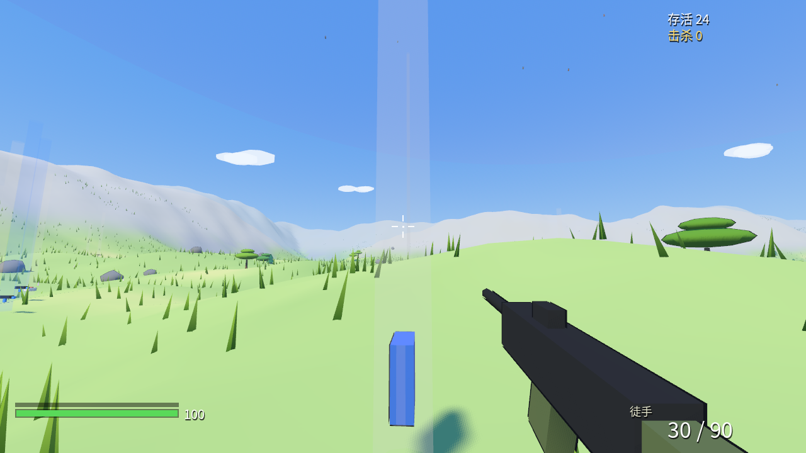
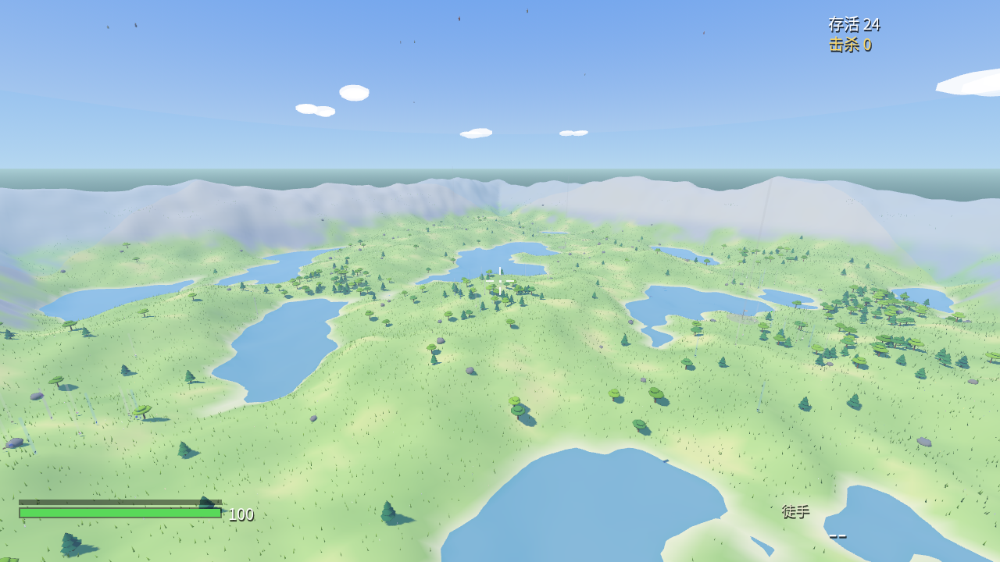
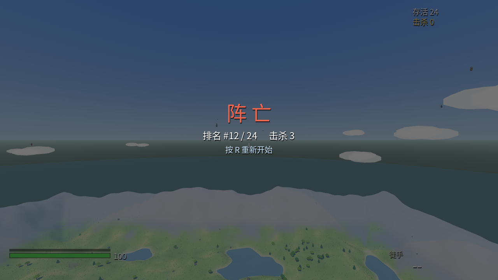

# 战地3 (zhandi3)

战地式大地图 FPS × 吃鸡大逃杀框架 × 旷野之息风格卡通渲染。使用 **Godot 4.7.1 + GDScript** 开发，全部素材（地形、植被、角色、建筑、载具、特效和音效）程序化生成，零外部素材依赖。

> **本项目是一款用 Kimi k3（Kimi Code CLI）开发的测试游戏**：从需求、编码、调试、验证到截图提交，全部由 AI 完成，用于检验 AI Agent 独立交付一个完整可玩游戏的能力。

## 游戏效果

以下截图均为工程内置 `--screenshot` 调试命令自动生成：

| 第一人称战斗视角 | 500m×500m 海岛全景 | 结算画面 |
| --- | --- | --- |
|  |  |  |

## 两张地图

### 群岛战场

- 你 + 23 个 AI 战士空降到 500m×500m 的海岛，赤手空拳落地
- 搜刮武器（冲锋枪/突击步枪/射手步枪）、护甲、医疗包、弹药——物资聚集在 3 座村庄（小屋/两层楼/仓库/瞭望塔）里，也有码头、废墟可探索
- 毒圈分 5 个阶段收缩，圈外持续掉血，越到后期越痛
- 地图上有 3 面旗帜据点（A/B/C），沙袋工事环绕，在圈内停留 5 秒占领，占领后**持续回血 + 伤害提升 10%**
- 春夏秋冬实时切换：地面、草木、水面、天空雾光、花瓣/落叶/雪和建筑雪盖同步变化
- 活到最后：**大吉大利，今晚吃鸡！**

### 海拉鲁阔野

- 你 + 8 名 AI 战士在阔野地图展开大逃杀：空降、搜刮地标补给、互相交战，活到最后同样吃鸡
- 解析式地貌塑造初始高原、双子山裂谷、海布拉雪山、中央丘陵、S 形海利亚河与奥尔汀火山；不是用随机噪声平均铺满的无名地形
- 神庙、三座古代测绘塔、时间神殿遗迹、海拉鲁城堡、44 米海利亚大桥、道路、芦苇、火堆和发光熔岩火口组成可辨识的探索地标
- 九段命名道路以土色直接绘制进地形表面，远近都看得见；路口有木质路标，驿站与桥边沿途立石灯
- 测绘塔带外侧螺旋梯、城堡有大门台阶、神庙有门前台阶、海利亚大桥两端有引桥石阶——所有高处的“楼梯”都能真的走上去
- 驿站旁有围栏马场、干草垛和货车；遗迹路上散落断裂立柱；花丛间有蝴蝶飞舞
- 河流具备水波、深浅色与岸线泡沫；玩家自动浮向水面，可游泳、上浮、下潜和加速，不再沉底行走
- 驿站具有 26 米圆形客栈、环廊、住宿间、接待柜台、马槽、拴马栏、灯笼和巨型马首帐篷顶，不再只是单层顶棚
- 可骑乘 4 匹不同毛色的马和古代科技摩托；马匹重做了头颈比例、分段步态和鞍具，马/摩托采用“镜头朝哪就往哪走”的现代骑乘操控（A/D 原地转身），吉普为渐进油门+速度转向，三者都有抓地惯性、坡地姿态与鼠标环绕镜头
- 8 个山野小怪会投石并近身冲锋；3 台飞行攻击器发射能量弹；火山巨龙巡航并喷火
- 野猪、狼、熊和鸟构成野生生态，击败动物掉落兽肉；蘑菇、兽肉和龙鳞可存入背包并用于恢复生命或护甲
- 开局空降或落地后从任意悬崖跃下时按住空格展开滑翔伞：伞始终向前飘行，W 俯冲提速、S 减速缓降、A/D 转向；伞面、伞绳和握杆在第一人称可见，常规下坠速度限制为 3.1m/s
- 攀爬系统：朝树干、塔身、悬崖、石壁等陡面推 W 即可攀爬，W/S 上下、A/D 横移、Space 蹬离；从塔顶或悬崖跃下再接滑翔伞是核心移动链路
- 砍树：射击或攻击树干两次即可砍倒（大树四次），树干朝远离你的方向倒伏，留下木桩并掉落可拾取的木材（护甲材料）；树木高 5~9m 可攀爬，阔叶、针叶、巨树三类树形随机散布
- 四位可交谈的 NPC：驿站老板、火山研究员、城堡卫兵、旅行商人，靠近按 E 获取路线与玩法提示
- 动物有警觉中间态（头顶 ! 定格注视再决定攻/逃）、狼讲群体规则；NPC 会因枪声抱头躲闪，行商沿道路往返巡逻
- 篝火烹饪：火堆旁使用生兽肉/蘑菇烤成回复更强的料理；地图各处藏有 10 颗呀哈哈式海拉鲁种子（捡到护甲 +5）
- 神庙试炼：两座神庙各藏限时符文试炼，射中全部 4 个符文获得精灵宝珠（生命上限 +10），超时重置可反复挑战
- 昼夜循环（6 分钟一天）：清晨/正午/黄昏/夜晚光照雾色全联动，夜晚狼群更凶，灯笼与火堆成为夜色主角，按 T 推进时间
- 血月事件：每三夜一次猩红血月，怪物全部苏醒；地图藏有风车与怪石呀哈哈谜题（命中出种子）与两处怪物营地
- 山林细节：白桦/阔叶/松/巨树四树种，林地倒木、蘑菇仙女环、蕨类丛；火山玄武岩柱群与雪线白顶岩
- 精力轮：冲刺/攀爬/滑翔消耗精力，耗尽会锁速、滑落、收伞；食物回复精力，准星旁环形精力指示
- 天气系统：晴雨交替，雨时地面湿滑反光、水面涟漪、雨幕与远雷闪电；两台古代守卫以红色激光追踪并发射光束
- 小精灵系统：死亡时自动消耗一只精灵复活（30% 生命），地图两处可捕捉；神庙第二试炼为点燃火盆；NPC 入夜打盹
- 古代剑：城堡平台深处奖励，近战伤害提升至 42；空手举盾在坡面上可盾牌滑行；第三神庙为压力板试炼
- 马匹具备旷野式自主性：松手自动沿道路行走、慢步/快步/疾驰三级步态、待机低头吃草；野马首次骑乘会尥蹶子，安抚后温顺
- 阔野地图自带补给：地标与营地分布 5 把武器、9 处弹药、医疗包与护甲，测绘塔顶与城堡平台藏有攀爬奖励
- 海利亚河岸为 20m 宽渐变滩涂：河床→沙滩→草坡可自然行走下水，怪物与野兽不会涉水追进河里
- 通用自动上台阶：驿站石基、神庙平台、断柱等 0.68m 以内台基直接迈上去，不用蹦
- 战斗反馈：命中有飘字伤害数字与受击缩放反馈，击败怪物有播报与倒地动画；小怪、野兽、飞行攻击器与巨龙全部可击杀并掉落兽肉/蘑菇/龙鳞/弹药
- 马匹头部使用手工楔形网格塑造笔直长脸，鬃毛为立式脊冠；地图整体色阶为高饱和旷野绿，天空布置大朵扁平白云
- 阔野地图是一套受开放世界卡通冒险启发的原创程序化实现，不包含外部游戏资产

## 操作

| 按键 | 功能 |
| --- | --- |
| W A S D | 移动 |
| 鼠标 | 视角 |
| 左键 | 射击；空手时挥剑（砍树、近战、点符文） |
| 右键 | 持枪时机瞄；空手时举盾格挡（瞬间举起为完美格挡） |
| Shift | 冲刺 |
| 空格 | 地面跳跃；高处下降时按住展开滑翔伞；水中上浮 |
| C | 地面趴下（更慢，扩散大幅降低）；水中下潜 |
| G | 投掷烟雾弹（烟球遮挡 AI 视线，初始 3 枚） |
| F | 靠近吉普车、马或摩托时骑乘 / 下车（W/S 前后，A/D 转向） |
| 推 W 朝陡面 | 攀爬树干 / 塔身 / 悬崖（Space 蹬离） |
| B | 打开 / 关闭背包（W/S 选择，E 取出或使用，X 存入当前武器） |
| M | 打开地图选择（1 群岛战场，2 海拉鲁阔野） |
| V | 循环切换春 / 夏 / 秋 / 冬 |
| R | 换弹 / 结算后重开 |
| E | 拾取 |
| H | 吹口哨召唤附近的马（45m 内小跑过来） |
| T | 推进 1 小时（昼夜流转） |
| 1 / 2 | 切换武器槽 |
| Esc | 释放鼠标（点击左键或再按 Esc 重新锁定） |
| — | 窗口失去焦点自动暂停，切回自动继续 |

## 运行

```bash
tools/Godot.app/Contents/MacOS/Godot --path .
```

首次运行如被 Gatekeeper 拦截：`xattr -dr com.apple.quarantine tools/Godot.app`

## 开发

### 结构

```
project.godot            # 工程配置（主场景 scenes/main.tscn）
scenes/main.tscn         # 极简根场景，一切由代码生成
scripts/
  main.gd                # 比赛总控：生成、击杀播报、胜负、buff 结算
  world/terrain.gd       # 噪声地形 + 顶点色 + 解析高度采样 + 水面（高度图驱动的水波 shader）
  world/wild_world.gd    # 阔野地图总成：神庙/驿站/遗迹/桥梁/火山/生态生成
  world/props.gd         # 树木/灌木/岩石/草（树冠/草丛 MultiMesh + 行进风场 shader）
  world/season_system.gd # 四季总控：地表/植被/水片/天空雾光/天气联动
  world/tex_gen.gd       # 程序化贴图工厂：叶簇/草叶/花朵 alpha 贴图
  world/buildings.gd     # 程序化建筑：村庄（小屋/两层楼/仓库/瞭望塔/废墟）、据点沙袋工事、码头小船
  world/toon.gd          # 卡通材质工厂（toon 光照 + grow 描边）
  player/player.gd       # FPS 控制器（移动/空降/游泳/滑翔/背包/骑乘）
  player/weapon.gd       # hitscan 武器逻辑 + 程序化视模型
  player/hud.gd          # 全套 HUD（中文用内置 Noto Sans SC 渲染）
  bots/bot.gd            # AI 状态机：空降→搜刮→跑圈→占点→交战
  game/zone.gd           # 毒圈：5 阶段收缩、圈外伤害、圈墙可视化
  game/capture_point.gd  # 据点：占领进度、旗帜变色、增益归属
  game/loot.gd           # 战利品：光柱稀有度、拾取逻辑
  game/vehicle.gd        # 吉普车：F 上下车、街机驾驶、贴地形
  game/horse.gd          # 马匹：程序化模型、骑乘控制与步态
  game/wild_motorcycle.gd # 古代摩托：程序化模型、悬挂与骑乘控制
  game/wild_creature.gd  # 野猪/狼/熊/鸟生态、攻击与掉落
  game/wild_monster.gd   # 山野小怪：巡逻、投石与冲锋
  game/wild_dragon.gd    # 火山巨龙：巡航、喷火与龙鳞掉落
  game/flying_attacker.gd # 古代飞行攻击器
  game/wild_projectile.gd # 石块/火焰/能量弹共用投射物
  game/smoke_grenade.gd  # 烟雾弹：引信起烟、遮挡 AI 视线
  fx/fx.gd               # 曳光/命中特效
  fx/sfx_bank.gd         # 音效池（2D/3D）
assets/
  shaders/ground.gdshader # 多尺度地表斑驳 + 岩层 + 积雪/湿润
  shaders/grass.gdshader # 草叶广告牌化 + 行进风场阵风 + 三段色带
  shaders/water.gdshader # 深度水色 + 岸线环 + 雨滴扩散 + 冬季冰裂
  sfx/*.wav              # tools/gen_sfx.py 生成（Python 标准库），含音乐/环境音循环
  fonts/                 # Noto Sans SC（HUD 中文）
tools/
  Godot.app              # Godot 4.7.1 编辑器/运行时
  gen_sfx.py             # 音效合成脚本
```

### 调试参数（`--` 之后传入）

```bash
# 截图（窗口模式，N 帧后存图退出）
tools/Godot.app/Contents/MacOS/Godot --path . -- --screenshot /tmp/shot.png [--frames 2700] [--cam x,y,z,tx,ty,tz]
# 无头模拟整场比赛并打印进度
tools/Godot.app/Contents/MacOS/Godot --headless --path . --quit-after 30000 -- --sim
# 玩家直接落地 + 自带步枪
tools/Godot.app/Contents/MacOS/Godot --path . -- --ground --arm
# 固定随机种子（可复现的比赛布局，便于调试/截图定位）
tools/Godot.app/Contents/MacOS/Godot --path . -- --seed 7
# 指定初始季节（spring / summer / autumn / winter）
tools/Godot.app/Contents/MacOS/Godot --path . -- --season winter
# 直接进入指定地图（battlefield / wild）
tools/Godot.app/Contents/MacOS/Godot --path . -- --map wild
# 阔野完整玩法回归：背包、游泳、悬崖滑翔、骑马、投射物、掉落、摩托、吉普转向与制动
tools/Godot.app/Contents/MacOS/Godot --headless --path . --quit-after 520 -- --wildtest --ground --arm --seed 7
# 地图选择与背包界面截图预览
tools/Godot.app/Contents/MacOS/Godot --path . -- --screenshot /tmp/map.png --mapmenutest
tools/Godot.app/Contents/MacOS/Godot --path . -- --screenshot /tmp/backpack.png --backpacktest --map wild
# 射击链路自检（生成测试bot并开火，打印血量）
tools/Godot.app/Contents/MacOS/Godot --headless --path . --quit-after 300 -- --firetest --ground --arm
# 失焦恢复自检（模拟漏收恢复通知，确认暂停外定时器能自动解锁）
tools/Godot.app/Contents/MacOS/Godot --headless --path . --quit-after 120 -- --noworld --ground --focusrecoverytest
# 四季联动自检（春→夏→秋→冬）
tools/Godot.app/Contents/MacOS/Godot --headless --path . --quit-after 120 -- --noworld --ground --seasontest
# 结算画面预览
tools/Godot.app/Contents/MacOS/Godot --path . -- --screenshot /tmp/end.png --endtest
```

### 重新生成音效

```bash
python3 tools/gen_sfx.py   # 仅依赖 Python 标准库
```

## AI 开发与测试过程

本项目由 Kimi k3 在与用户很少的交互下完成，典型闭环：用户提需求/报告问题 → AI 读代码定位 → 修复 → 自动化验证 → 用户试玩确认。

完整的问题复盘、Godot/GDScript 踩坑记录和推荐排障顺序见 [开发与排障笔记](docs/DEVELOPMENT_NOTES.md)。

### 自动化验证手段（全部内置在工程里）

- `--headless --import` + `--quit-after N`：编译与运行时错误检查，每次改动必跑
- `--screenshot`：窗口模式定时自动截图，视觉改动以图像确认（上方效果图即该命令产物）
- `--firetest` / `--movetest`：射击链路与移动的脚本化自检
- `--sim`：无头模拟整场比赛（24 人 + 完整毒圈流程），可挂内存/对象数探针做压测

### 真人试玩驱动修复的真实案例

- **持枪后无法转向/开火**：试玩发现「徒手正常、持枪失灵」，定位为屏幕中心准星控件（`mouse_filter=STOP`）吞掉捕获模式下的全部鼠标事件 → HUD 全部改为 `IGNORE`
- **鼠标捕获丢失后游戏「假死」**：点击左键重新锁定鼠标（标准 FPS 行为）
- **「玩着玩着卡住」**：用无头模拟赛 + 心跳/内存探针复现排查，确认游戏无泄漏、无死循环；同时针对 macOS 窗口失焦导致输入全断的问题，增加失焦自动暂停、切回自动继续
